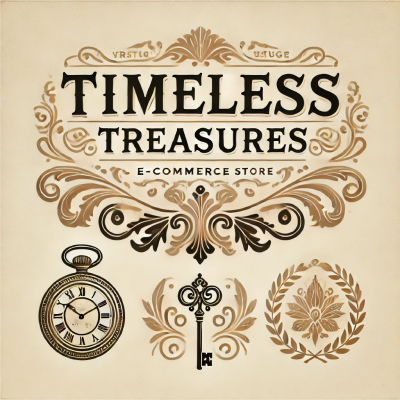

# Timeless Treasure UI  

The **Timeless Treasure UI** is a fully crafted, modern, and elegant e-commerce platform celebrating the beauty of vintage items and books. Designed with vintage enthusiasts in mind, this app offers a seamless and delightful shopping experience, blending functionality with aesthetic charm.  

  


## 📌 Project Overview  
Timeless Treasure UI serves as the user interface for our e-commerce platform dedicated to vintage treasures. From timeless books to artistic vases, the platform celebrates the elegance of the past while delivering a smooth, intuitive shopping journey.  

### 🌟 Key Features  
- **Fully Responsive Design**: A seamless experience across devices.  
- **Modern UI**: Minimalistic and elegant interface using **React** and **Tailwind CSS**.  
- **Dedicated Pages**:  
  - Home  
  - Shop
  - Product Listing
  - Product Page  
  - About  
  - Cart
- **Live Preview**: Deployed on Vercel for easy access.  

[Live Demo on Vercel](https://timeless-treasures-ui.vercel.app/)  


## 🛠️ Tech Stack  
- **React**: Component-based framework for dynamic and reusable UI.  
- **Tailwind CSS**: Utility-first framework for rapid styling.  
- **Vercel**: Deployed for fast and reliable hosting.  


## 🚀 How to Run Locally  
Follow these steps to clone and run the project locally:  

1. **Clone the Repository**:  
   ```bash  
   git clone https://github.com/yourusername/timeless-treasures-ui.git  
   cd timeless-treasures-ui  
   ```  

2. **Install Dependencies**:  
   ```bash  
   npm install  
   ```  

3. **Start the Development Server**:  
   ```bash  
   npm start  
   ```  

4. Open `http://localhost:3000` in your browser.  


## 📝 Future Enhancements  
Although the project is complete, there’s room for adding more features:  
- Wishlist functionality  
- User authentication and profile management  
- Integration with a backend for real-time product management  


Thank you for exploring **Timeless Treasure UI**! Feedback and suggestions are always welcome to help improve the project. 💎  

[GitHub Repository](https://lnkd.in/dD2DWXTY) | [Live Demo](https://timeless-treasures-ui.vercel.app/)  
